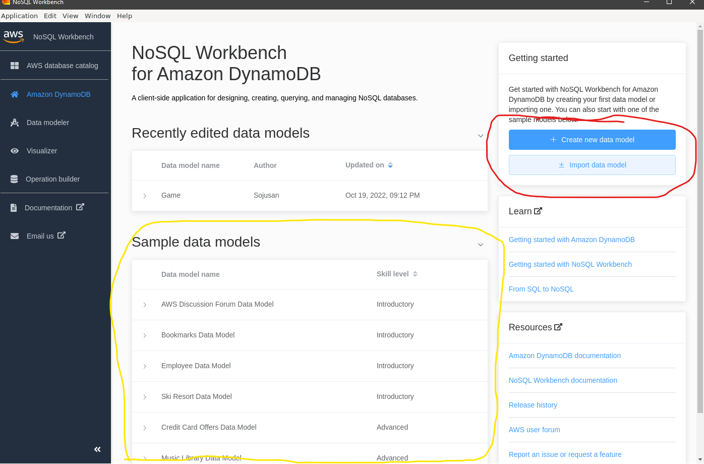
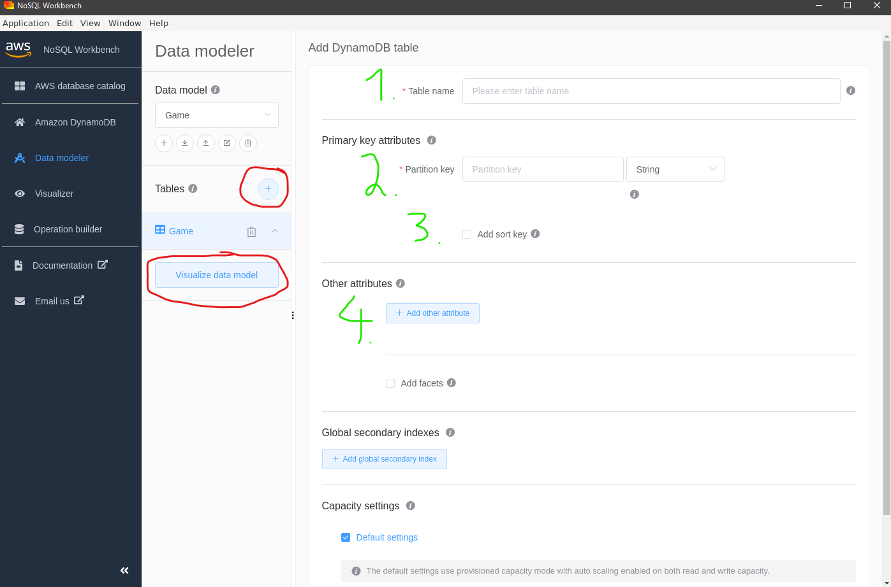
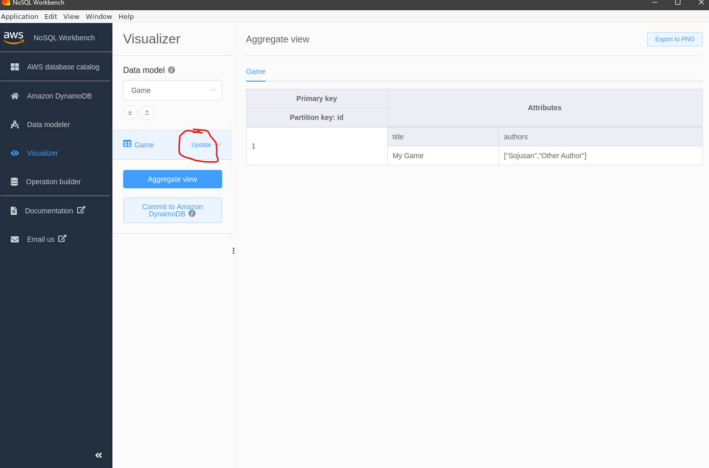
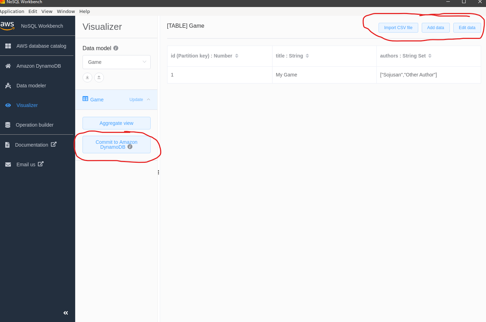
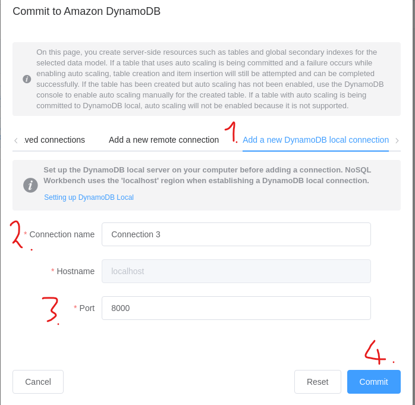
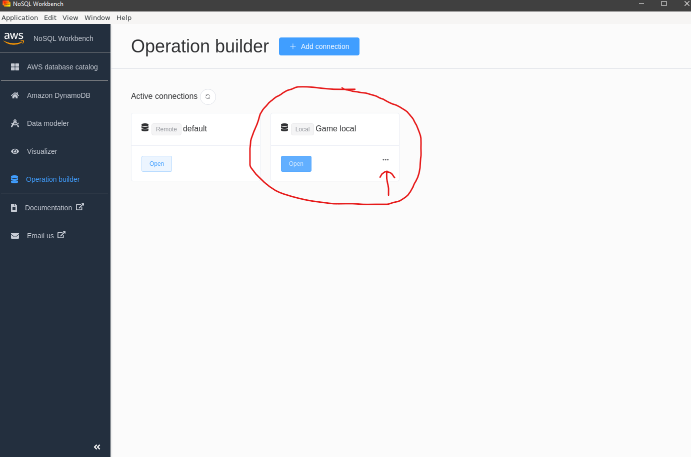
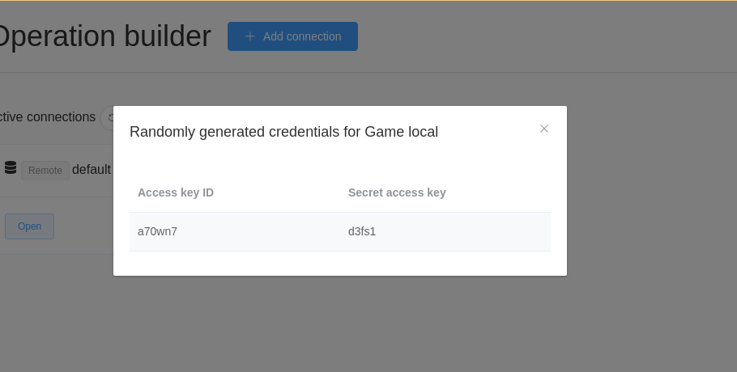
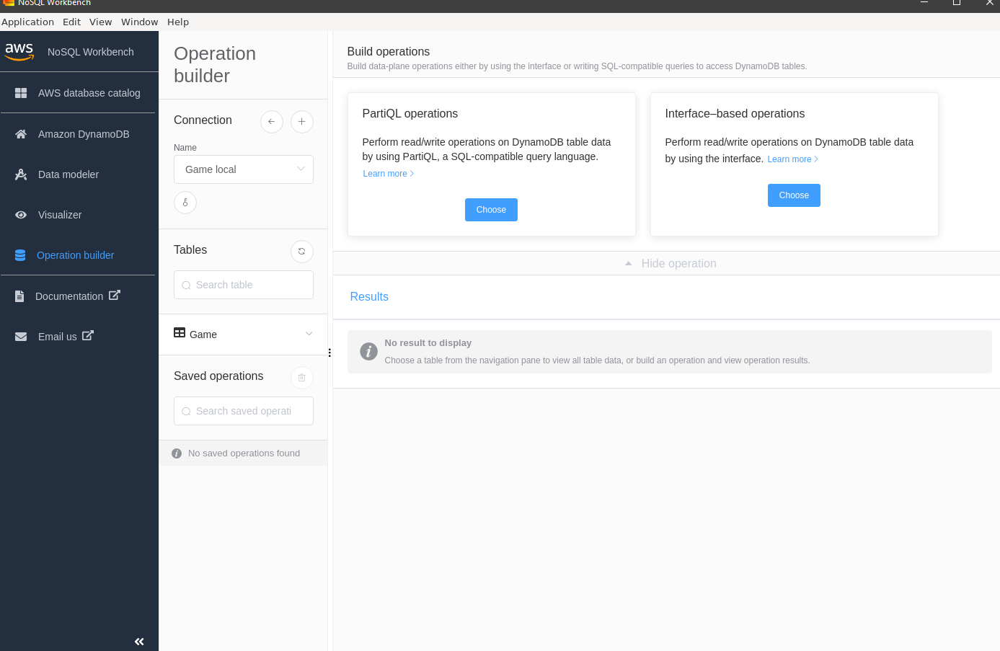

# Run AWS Lambda and DynamoDB locally using docker

## Requirements

The applications below should be installed to make lambdas run locally:

1. [Docker](https://www.docker.com/)
1. [AWS Serverless Application Model (AWS SAM CLI)](https://docs.aws.amazon.com/serverless-application-model/latest/developerguide/serverless-sam-cli-install.html)
1. [AWS Command Line Interface (AWS CLI)](https://aws.amazon.com/cli/)
1. [NoSQL Workbench for DynamoDB](https://docs.aws.amazon.com/amazondynamodb/latest/developerguide/workbench.html)

## Setup

### Create Docker Network

```sh
docker network create local-api-network
```

### DynamoDB Local Setup

DynamoDB is a NoSQL Key-Value Database.

```sh
docker run -d -p 8000:8000 --network=local-api-network --name dynamo-local amazon/dynamodb-local
```

Just to check if DynamoDB is working and we have connection:

```sh
aws dynamodb list-tables --endpoint-url http://localhost:8000
```

If error occurred:

`
You must specify a region. You can also configure your region by running "aws configure".
`

Run the command:

```sh
aws configure
```

In section of region provide the value `localhost`, in other places provide any value but do not leave it empty.

### Create table and data with NoSQL Workbench



In order to create our own data model we need to use options shows on the red field.
If we just want to test the DynamoDB we can import one of the predefined data models shows on the yellow field.

We will create our own data model.



In order to create a table we need to click the plus sign button and then provide some information:

1. The name of the table you want to create.
2. The primary key of the table you want to create.
3. Optionally there could be also the sort key e.g timestamp.
4. Add other fields to the table.

After the creation of the table we can `Visualize our data model`.



On aggregate view we can see our data model. By clicking `Update` near the table name we can switch to the table items editor.



We can import from csv file or add/edit items in our table.
After the items creation we can commit our data model to the database.



In order to commit our data model firstly we need to define the database connection:

1. Switch to the local connection tab.
2. Provide a connection name.
3. Switch to a port created during docker startup.
4. Commit data model to the database under new connection.



Our new local connection is established. In order to connect to the database we need to configure the database connection in our AWS CLI. The credentials to our local database are under the three dot button.



Run the command `aws configure` and provide the credentials.

> :warning: Remember to set region value to **localhost**.



The operation builder is a UI to interact with our local DynamoDB instance. We can create new tables or insert some items to existing ones and more. If you are interested with this topic feel free to interact with it on your own :)

## Run the API using SAM

```sh
sam local start-api --docker-network local-api-network
```

## Resources

* [How to run API Gateway, AWS Lambda and DynamoDB locally](https://medium.com/@amorenom/how-to-run-api-gateway-aws-lambda-and-dynamodb-locally-91b75d9a54fe)
